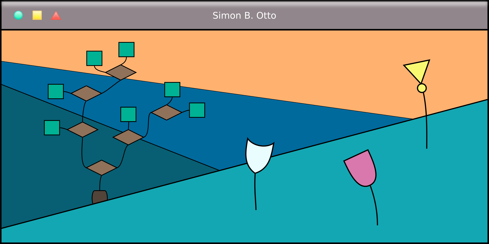

### Hi there, I'm Simon👋

I'm a student of computer engineering that enjoys developing robots and autonomous systems. Lately, my focus is on the
fascinating topic of reinforcement learning.   
I'm also passionate about sharing my knowledge with interested people.  
So feel free to browse my repositories and [contact me](simon.otto@stud.uni-heidelberg.de)!

<!--
**5i0770/5i0770** is a ✨ _special_ ✨ repository because its `README.md` (this file) appears on your GitHub profile.

Here are some ideas to get you started:

- 🔭 I’m currently working on ...
- 🌱 I’m currently learning ...
- 👯 I’m looking to collaborate on ...
- 🤔 I’m looking for help with ...
- 💬 Ask me about ...
- 📫 How to reach me: ...
- 😄 Pronouns: ...
- ⚡ Fun fact: ...
-->
